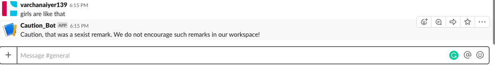

# sexist_caution_bot

## Sexism at Workplace
Four in ten women in the United States have faced gender dicrimination at their workplace. Discrimination occurs in several ways like pay gap, lesser representations and unconsicous bias. While global companies are taking women specific recuriment drives in a serious manner, there is still a greater need to control sexist remarks or biases in a workplace. The first step in doing so is regulating messages or conversations in a workplaces.

A Sexism Caution Bot is integerable with slack. It can help to find specific sexist remarks in conversation. For starters it can implemented in the public channels of workplace and serve as a reminder to employees/users who might be potraying an unconsicious sexual bias

## Work done
- Model trained to detect insults, obscene and toxic comments
- Added frequently used sexist terms
- Baisc bot is build. Now need to improve it and add more features

## Slack Invite

You can join the slack group to test out the bot and suggest features.

Click [here](https://join.slack.com/t/sexist-caution-bot/shared_invite/enQtNTQyNzE1MzMxODE1LTZiNDJjYWZjZWU1ZDIwOGQ1ZGY3NTE2YWUxY2RlY2NjMGIzMmRjMmFjYmJlNjkwNTc2MTU4ZTVjMjA0NGFkZWM) to join the slack workspace

## HELP NEEDED!
Unfortunately there are no proper datasets for common sexist remarks at workplaces. The avaliable datasets that I have come across are extremely vulgar/obscene. However, sexist remarks in workplaces are often subtle or contain some usual phrases like "Girls are like that".

## Crowdsourcing Data
Please feel free to push any sort of data or remark you find suitable to this project. I believe that sexism in workplace conversations is a global problem. I hope that this bot will be a step towards eliminating it. Therefore, I need crowdsourced to improve the model and make it more usable.

## Further Work
- Logging to catch repeated offendors: The bot will log details of repeated offendors and will send a message to the workspace admin. Regular offendors will also be shown and incremantal 'testosterone level' value
- Audio Analysis: If the data gathered is signficant enough, we can move this to audio/speech reognition of sexist comments. For example this bot could be integerated with existing virtual assistants to give out warnings if a sexist remark is heard in a meeting.
